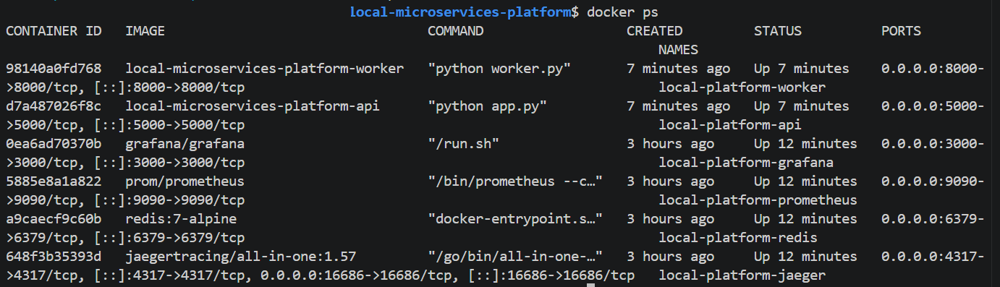
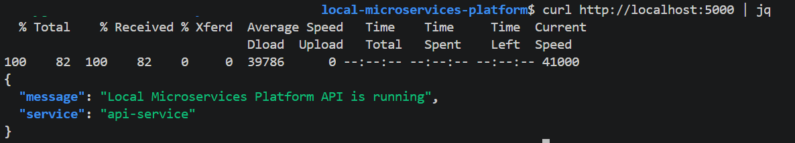
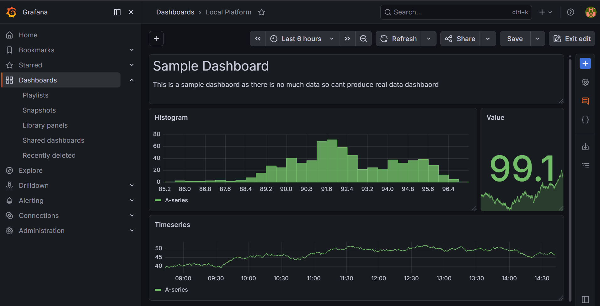
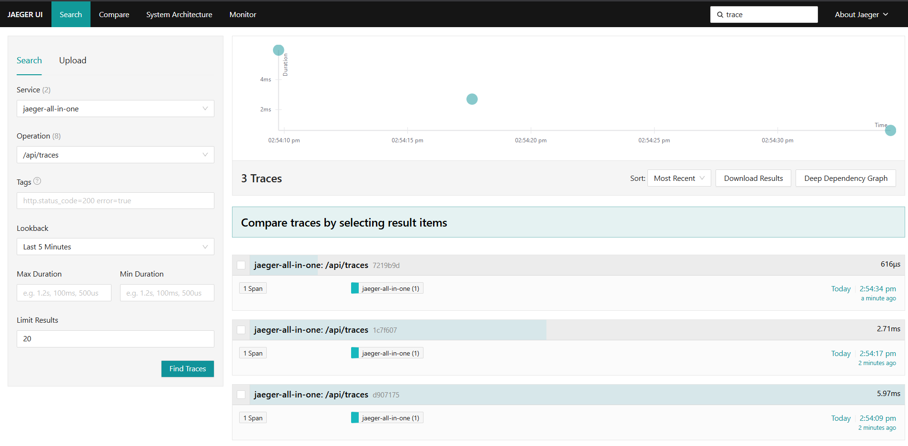

## ⚡ Quick Overview


This is a production-style microservices platform that runs entirely locally and includes:
- API + Worker architecture
- Redis-based asynchronous processing
- Docker & Kubernetes deployment
- CI/CD pipelines
- Full observability stack (Prometheus, Grafana, Jaeger)

👉 Run everything locally with a single command:
```md
docker compose up --build`
```

`No cloud providers or paid services required.`


## 🧠 What This Project Demonstrates

* Multi-service architecture (API + Worker)
* Asynchronous processing using Redis queue
* Containerization with Docker
* Local orchestration using Docker Compose
* Kubernetes deployment (Kind cluster)
* CI/CD pipelines using GitHub Actions
* Observability:
  * Metrics (Prometheus)
  * Dashboards (Grafana)
  * Distributed tracing (Jaeger)

## 🧰 Tech Stack

* Python (Flask)
* Redis
* Docker & Docker Compose
* Kubernetes (Kind)
* GitHub Actions (CI/CD)
* Prometheus & Grafana
* Jaeger (Tracing)

## 🏗️ Architecture Overview

```text
Client
  │
  ▼
API Service (Flask)
  │
  ▼
Redis Queue
  │
  ▼
Worker Service
  │
  ▼
Processing

Observability Layer:
- Prometheus (metrics)
- Grafana (dashboards)
- Jaeger (tracing)
```

## 📁 Project Structure

```bash
local-microservices-platform/
│
├── services/
│   ├── api/
│   ├── worker/
│
├── docker-compose.yml
├── kubernetes/
│
├── monitoring/
│   ├── prometheus/
│   ├── grafana/
│
├── .github/workflows/
│   ├── ci.yml
│   ├── release.yml
│
├── screenshots/
│
└── README.md
```

## ⚙️ Prerequisites

Install the following before running:

* Docker
* Docker Compose
* Git
* (Optional) Kind + kubectl (for Kubernetes mode)

# 🚀 Run the Platform Locally

Run the entire platform locally:

```bash
docker compose up --build
```

## 🧪 Interact with the System

### 1. Check API

```bash
curl http://localhost:5000
```

### 2. Health Check

```bash
curl http://localhost:5000/health
```

### 3. Create a Task

```bash
curl -X POST http://localhost:5000/tasks \
  -H "Content-Type: application/json" \
  -d "{\"message\":\"Hello from microservices platform\"}"
```

### 4. Check Queue

```bash
curl http://localhost:5000/tasks/queue
```

### 5. View Worker Logs

```bash
docker compose logs worker
```

# 📊 Observability

## 🔹 Prometheus (Metrics)

```text
http://localhost:9090
```

Example metrics:

* `api_tasks_created_total`
* `worker_tasks_processed_total`

## 🔹 Grafana (Dashboards)

```text
http://localhost:3000
```

Login:

```text
admin / admin
```

Add Prometheus as a data source:

```text
http://prometheus:9090
```

## 🔹 Jaeger (Tracing)

```text
http://localhost:16686
```

Use this to trace requests across services:

```text
API → Redis → Worker
```

# ☸️ Kubernetes Mode (Optional)

Run the platform in Kubernetes using Kind.

### Create cluster

```bash
kind create cluster --name microservices-platform
```

### Build images

```bash
docker build -t local-microservices-api:local ./services/api
docker build -t local-microservices-worker:local ./services/worker
```

### Load images

```bash
kind load docker-image local-microservices-api:local --name microservices-platform
kind load docker-image local-microservices-worker:local --name microservices-platform
```

### Deploy

```bash
kubectl apply -f kubernetes/
```

### Access API

```bash
kubectl port-forward -n microservices-platform svc/api-service 5000:80
```

# 🔁 CI Pipeline

GitHub Actions pipeline runs on every push.

It validates:

* Python syntax
* Docker image builds
* Kubernetes manifests

# 📦 Release Pipeline

Triggered using Git tags.

```bash
git tag v1.0.0
git push origin v1.0.0
```

This will:

* Build versioned Docker images
* Tag `latest`
* Simulate deployment

# 🧹 Cleanup

Stop everything:

```bash
docker compose down
```

Delete Kubernetes:

```bash
kubectl delete -f kubernetes/
kind delete cluster --name microservices-platform
```

# 📸 Screenshots

### Docker Containers Running


### API Response


### Grafana Dashboard


### Jaeger Tracing


# 📚 How to Use This Project

This project can be explored in stages:

### 1. Run locally with Docker Compose
Understand how services communicate

### 2. Explore logs and queue
See how API → Redis → Worker flow works

### 3. Monitor with Prometheus & Grafana
Understand system metrics and observability

### 4. Trace requests with Jaeger
Follow distributed requests across services

### 5. Deploy to Kubernetes (optional)
Run the same system in a cluster environment

# 🎯 Key Takeaways

This project demonstrates:

* How real distributed systems are structured
* How DevOps workflows operate locally
* How observability is implemented end-to-end
* How to simulate production systems without cloud providers


# 👤 Author

**Binaya Ghimire**